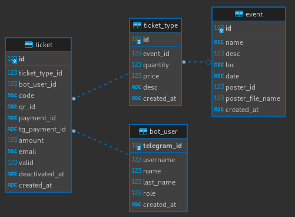

## 🇬🇧 Telegram store for selling tickets with built-in payment via YooMoney and Telegram Payments

- asynchronous library [python-telegram-bot v20.4](https://github.com/python-telegram-bot/python-telegram-bot) is used.
- aiosqlite is used for asynchronous interaction with SQLite database
- using Jinja2 for templates - easy to translate into any language
- Telegram Payments as built-in payment system and YooMoney as payment provider

## 🇷🇺 Telegram магазин для продажи билетов со встроенной оплатой через YooMoney и Telegram Payments

- используется асинхронная библиотека [python-telegram-bot v20.4](https://github.com/python-telegram-bot/python-telegram-bot)
- используется aiosqlite для асинхронного взаимодействия с бд SQLite
- использование Jinja2 для шаблонов - легко перевести на любой язык
- Telegram Payments в качестве встроенной платежной системы и YooMoney в качестве платежного провайдера

## Команды бота:

- `/start` — приветственное сообщение
- `/help` — справка
- `/events` — мероприятия
- `/mytickets` — список билетов с QR-кодами
- `/story`— история покупок
- `/stat` — статистика продаж для админов

## Запуск

1. Скопируйте `.env.example` в `.env` и отредактируйте `.env` файл, заполнив в нём все переменные окружения:
2. требуется Python 3.11.
3. Установка зависимостей и запуск бота:
```bash
   pip install -r requirements.txt
   py -m ticket_bot
```
- В первый раз необходимо создать базу данных:
```bash
  cat db.sql | sqlite3 db.sqlite3
```
## Схема бд


